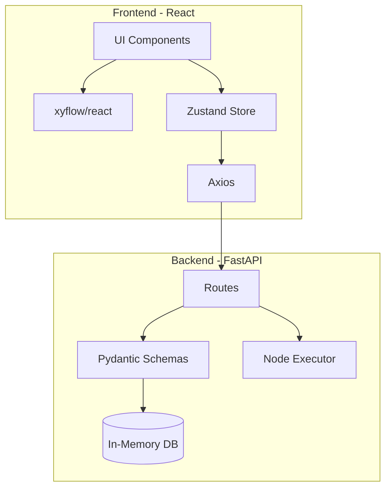
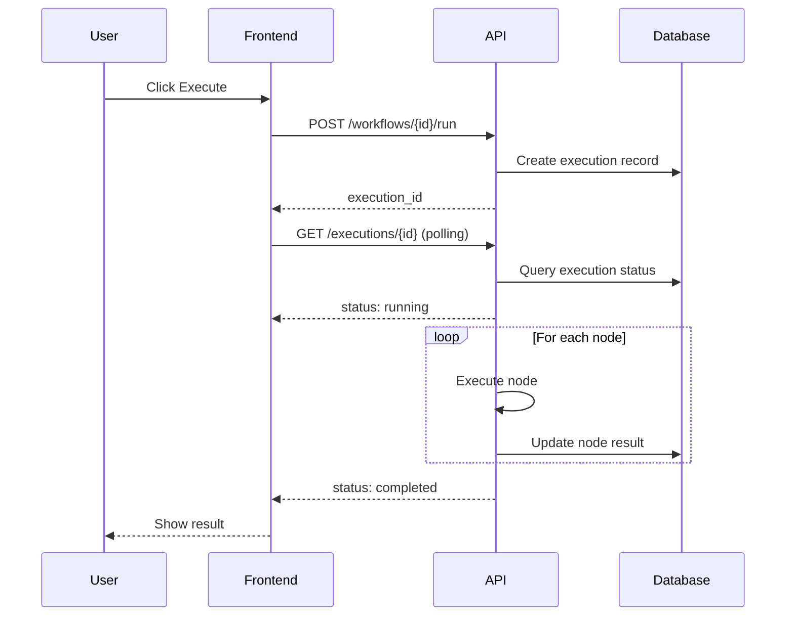
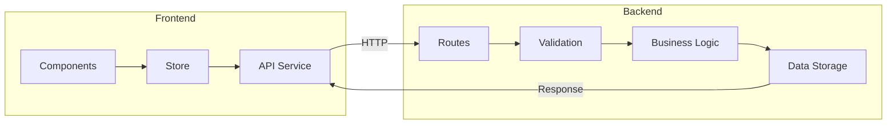

# QS2 Workflow 项目架构文档

## 项目概述

QS2 Workflow 是一个可视化的工作流编排应用，用于大型语言模型操作的编排（包括训练、压缩、推理、部署）。项目采用前后端分离架构：

- **后端**：Python FastAPI
- **前端**：React + TypeScript + Vite

---

## 技术栈架构

### 前端技术栈

| 技术 | 版本 | 用途 |
|------|------|------|
| React | 19.2.0 | UI 框架 |
| TypeScript | 5.9.3 | 类型系统 |
| Vite | 7.3.1 | 构建工具 |
| @xyflow/react | 12.10.1 | 工作流可视化编辑器 |
| Zustand | 5.0.11 | 状态管理 |
| Axios | 1.13.6 | HTTP 客户端 |
| Tailwind CSS | 4.2.1 | 样式框架 |

**入口文件**: `web/src/main.tsx` → `web/src/App.tsx`

**核心组件**:
- `WorkflowEditor.tsx` - 主编辑器（React Flow）
- `Toolbar.tsx` - 工具栏（执行/保存等）
- `Sidebar.tsx` - 侧边栏（节点选择）
- `ConfigPanel.tsx` - 配置面板

### 后端技术栈

| 技术 | 版本 | 用途 |
|------|------|------|
| FastAPI | >=0.104.0 | Web 框架 |
| Uvicorn | >=0.24.0 | ASGI 服务器 |
| Pydantic | >=2.5.0 | 数据验证 |
| pytest | >=7.4.0 | 测试框架 |
| httpx | >=0.25.0 | HTTP 客户端(测试) |

**入口文件**: `api/main.py`

**核心模块**:
- `database.py` - 内存数据库
- `schemas.py` - Pydantic 模型
- `routes/` - API 路由（workflows, nodes, executions）

### 开发环境

```bash
# 后端
cd api
pip install -r requirements.txt
python main.py                    # 启动 API 服务器 http://localhost:8000

# 前端
cd web
npm run dev                       # 启动开发服务器 http://localhost:5173
```

---

## 系统架构图

### 整体架构



### 工作流执行时序图



### 前后端交互流程



---

## 前后端交互模式

### API 规范

- **Base URL**: `http://localhost:8000/api/v1`
- **实时通信**: HTTP 轮询（2秒间隔）
- **无**: WebSocket / SSE

### 核心 API 端点

| 方法 | 路径 | 描述 |
|------|------|------|
| GET | /health | 健康检查 |
| POST | /workflows | 创建工作流 |
| GET | /workflows | 获取工作流列表 |
| GET | /workflows/{id} | 获取工作流详情 |
| PUT | /workflows/{id} | 更新工作流 |
| DELETE | /workflows/{id} | 删除工作流 |
| POST | /workflows/{id}/run | 执行工作流 |
| GET | /executions/{id} | 获取执行状态 |
| GET | /nodes/types | 获取节点类型 |

### 数据流

```
前端(Axios) → 后端(FastAPI) → 内存数据库
     ↓
  Zustand Store
     ↓
 React Flow 画布
```

---

## 核心模块说明

### 工作流编辑器

前端使用 `@xyflow/react` (React Flow) 实现可视化工作流编辑器，支持：
- 拖拽式节点编排
- 节点连线配置
- 节点配置面板
- 画布缩放和平移

### 状态管理

使用 Zustand 管理前端状态：
- 当前工作流数据
- 节点配置
- 执行状态
- UI 状态（侧边栏、面板开关等）

### 节点执行引擎

后端节点执行引擎：
- 支持 6 种节点类型：train_node, compress_node, inference_node, deploy_node, data_node, condition_node
- 拓扑排序确保节点按依赖顺序执行
- 状态追踪和结果存储

---

## 数据结构定义

### 节点类型

项目支持以下 6 种节点类型：

| 类型 | 名称 | 说明 |
|------|------|------|
| `train_node` | 训练节点 | 模型训练 |
| `compress_node` | 压缩节点 | 模型压缩 |
| `inference_node` | 推理节点 | 模型推理 |
| `deploy_node` | 部署节点 | 模型部署 |
| `data_node` | 数据节点 | 数据处理 |
| `condition_node` | 条件节点 | 条件分支 |

### 后端数据模型 (Pydantic)

```python
# 节点数据
class NodeData(BaseModel):
    label: str                          # 节点显示名称
    config: Dict[str, Any] = {}         # 节点配置

# 节点
class Node(BaseModel):
    id: str                             # 节点唯一标识
    type: str                           # 节点类型
    position: Dict[str, float]         # 位置 {x, y}
    data: NodeData                      # 节点数据

# 连线
class Edge(BaseModel):
    id: str                             # 连线唯一标识
    source: str                         # 源节点 ID
    target: str                         # 目标节点 ID
    sourceHandle: Optional[str] = None # 源 Handle
    targetHandle: Optional[str] = None # 目标 Handle

# 工作流图
class Graph(BaseModel):
    nodes: List[Node] = []              # 节点列表
    edges: List[Edge] = []              # 连线列表

# 工作流响应
class WorkflowResponse(BaseModel):
    id: str
    name: str
    description: str
    graph: Dict[str, Any]               # 图结构 JSON
    version: int
    status: str
    created_at: datetime
    updated_at: datetime
```

### 前端数据模型 (TypeScript)

```typescript
// 节点类型
type NodeType =
  | 'train_node'
  | 'compress_node'
  | 'inference_node'
  | 'deploy_node'
  | 'data_node'
  | 'condition_node';

// 节点数据
interface NodeData {
  label: string;
  type: NodeType;
  config: Record<string, any>;
}

// 工作流节点
interface WorkflowNode {
  id: string;
  type: NodeType;
  position: { x: number; y: number };
  data: NodeData;
}

// 工作流连线
interface WorkflowEdge {
  id: string;
  source: string;
  target: string;
  sourceHandle?: string;
  targetHandle?: string;
}

// 工作流
interface Workflow {
  id: string;
  name: string;
  nodes: WorkflowNode[];
  edges: WorkflowEdge[];
}

// 执行状态
interface WorkflowExecution {
  execution_id: string;
  workflow_id: string;
  status: 'pending' | 'running' | 'completed' | 'failed';
  started_at: string;
  finished_at?: string;
  outputs?: any;
  node_executions?: any[];
}
```

### 数据流转示意

```
┌─────────────────┐     ┌─────────────────┐     ┌─────────────────┐
│   Frontend      │     │   API Layer     │     │   Database      │
│                 │     │                 │     │                 │
│ WorkflowNode    │────▶│ Node (Pydantic) │────▶│ nodes: []       │
│ WorkflowEdge    │     │ Edge (Pydantic) │     │ edges: []       │
│                 │     │                 │     │                 │
└─────────────────┘     └─────────────────┘     └─────────────────┘
        │                       │                       │
        │ JSON                   │ Validation           │ In-Memory
        └───────────────────────┴───────────────────────┘
```

---

## 项目完成度

### 已实现功能 ✅

| 模块 | 功能 | 状态 |
|------|------|------|
| **工作流管理** | CRUD 操作 | ✅ |
| **工作流执行** | 节点拓扑排序执行 | ✅ |
| **节点类型** | 6 种节点类型 | ✅ |
| **可视化编辑** | 拖拽式节点编排 | ✅ |
| **状态管理** | Zustand 状态管理 | ✅ |
| **API 路由** | 基本 REST API | ✅ |
| **测试** | 基础单元测试 | ✅ |

### 未实现功能 ❌

| 模块 | 功能 | 优先级 |
|------|------|--------|
| **认证授权** | Bearer Token 认证 | P1 |
| **数据集管理** | 数据集 CRUD API | P2 |
| **模型管理** | 模型列表 API | P2 |
| **部署管理** | 部署 CRUD API | P2 |
| **持久化存储** | SQLite/PostgreSQL | P1 |
| **实时通信** | WebSocket/SSE | P2 |
| **用户管理** | 多用户支持 | P2 |
| **版本控制** | 工作流版本管理 | P3 |

---

## 后续补充建议

### 短期目标 (P0-P1)

1. **持久化存储**
   - 集成 SQLite 作为本地存储
   - 考虑未来迁移到 PostgreSQL

2. **认证授权**
   - 实现 Bearer Token 认证
   - 保护所有 API 端点

### 中期目标 (P2)

1. **实时通信**
   - 引入 WebSocket 或 SSE
   - 替代轮询机制

2. **资源管理 API**
   - 数据集 CRUD
   - 模型列表和配置
   - 部署管理

3. **用户管理**
   - 多用户支持
   - 权限控制

### 长期目标 (P3)

1. **版本控制**
   - 工作流版本管理
   - 回滚功能

2. **高级功能**
   - 节点模板
   - 工作流市场
   - 团队协作

---

## 附录

### 目录结构

```
dify-flow/
├── api/                    # 后端
│   ├── main.py            # 入口文件
│   ├── database.py        # 内存数据库
│   ├── schemas.py        # Pydantic 模型
│   ├── routes/            # API 路由
│   │   ├── workflows.py
│   │   ├── nodes.py
│   │   └── executions.py
│   └── tests/             # 测试
├── web/                   # 前端
│   ├── src/
│   │   ├── components/   # React 组件
│   │   ├── store/         # Zustand 状态管理
│   │   ├── services/      # API 服务
│   │   └── types/         # TypeScript 类型
│   ├── package.json
│   └── vite.config.ts
├── ARCHITECTURE.md        # 本文档
└── CLAUDE.md             # 项目指南
```

### API 规范文档

详细的 API 规范请参考 [api-spec.md](./api-spec.md)
